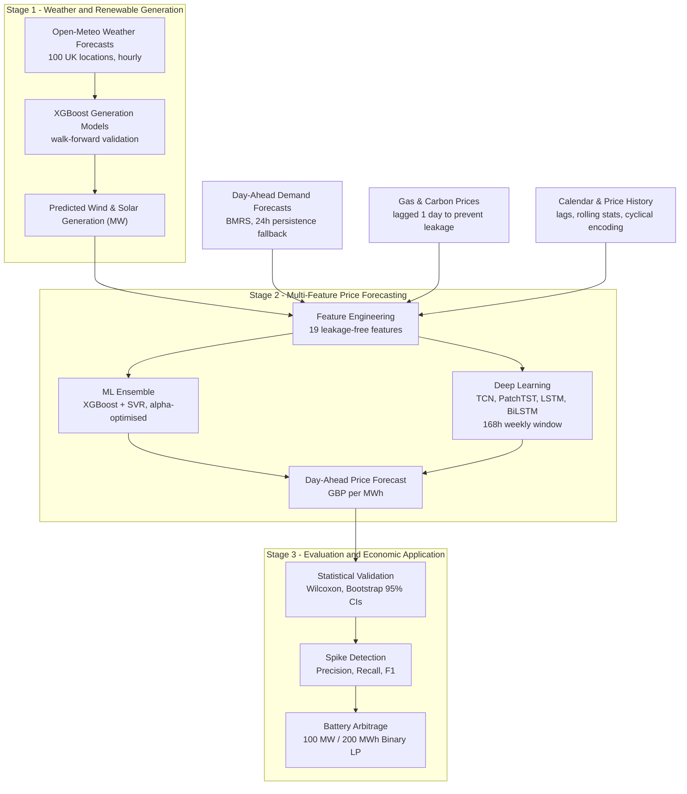

# UK Electricity Price Forecasting

**BENV0148 Advanced Machine Learning | University College London | Due: 29 April 2026**

Day-ahead electricity price prediction for the GB market using a two-stage **weather -> renewable generation -> price** pipeline, combining classical ML (XGBoost, SVR) with deep learning (TCN, PatchTST, LSTM, BiLSTM), and evaluated through a battery storage arbitrage simulation.

---

## Table of Contents

1. [Introduction](#1-introduction)
2. [Literature Review](#2-literature-review)
3. [Research Questions](#3-research-questions)
4. [Pipeline Overview](#4-pipeline-overview)
5. [Data](#5-data)
6. [Models](#6-models)
7. [Results and Analysis](#7-results-and-analysis)
8. [Limitations](#8-limitations)
9. [Conclusion](#9-conclusion)
10. [Team Contributions](#10-team-contributions)
11. [Generative AI Acknowledgement](#11-generative-ai-acknowledgement)
12. [References](#12-references)

---

## 1. Introduction

GB electricity prices are set through a day-ahead auction and are highly volatile, driven by weather-dependent renewable generation, demand cycles, and fuel costs. Conventional statistical models treat price as a univariate time series, missing the physical causality that underlies price formation (Weron, 2014). A model that observes an imminent wind drought in weather forecast data hours before it affects generation output can anticipate the associated price spike that a price-history model cannot.

This project builds a **two-stage physical causality pipeline**: Stage 1 predicts renewable generation from weather forecasts; Stage 2 uses those predictions alongside demand, fuel, and carbon features to forecast day-ahead prices. The pipeline combines classical ML with four deep learning architectures and evaluates the economic value of improved forecasts through a battery storage arbitrage simulation.

---

## 2. Literature Review

Weron (2014) surveys over 300 EPF studies and concludes that autoregressive models such as ARIMA fail to capture exogenous drivers -- a gap this project addresses directly by incorporating weather, demand, and fuel features.

Lago et al. (2021) benchmark deep neural networks and LEAR across European markets, finding that systematic hyperparameter tuning and ensemble blending consistently outperform single-model approaches. This motivates the grid-searched XGBoost + SVR ensemble used here.

Grinsztajn, Oyallon and Varoquaux (2022) show empirically that gradient-boosted trees outperform deep learning on heterogeneous tabular data, justifying XGBoost (Chen and Guestrin, 2016) as the primary classical ML component. Liu et al. (2024) confirm SVR's competitiveness in multi-market EPF, informing the ensemble design.

For deep learning, Bai, Kolter and Koltun (2018) demonstrate that TCNs with dilated causal convolutions match LSTM performance with full training parallelism. Nie et al. (2023) introduce PatchTST, which segments sequences into overlapping patches before applying Transformer self-attention -- an approach that aligns naturally with electricity prices' 24-hour diurnal structure. Hochreiter and Schmidhuber (1997) and Schuster and Paliwal (1997) provide the LSTM and BiLSTM baselines.

| Gap in Prior Literature | This Study's Response |
|------------------------|----------------------|
| Price-only models miss physical causality | Explicit weather -> generation -> price chain |
| Exogenous features often introduce look-ahead bias | Day-ahead forecasts only; 24h persistence demand fallback |
| DL architectures rarely compared systematically in EPF | LSTM, BiLSTM, TCN, PatchTST under identical conditions |
| Extreme price event detection rarely evaluated | Precision, Recall, F1 at 95th-percentile threshold |
| Economic value of forecast improvement not demonstrated | Battery LP arbitrage closes the loop |

---

## 3. Research Questions

1. Does modelling the **weather -> renewable generation -> price** chain improve day-ahead forecast accuracy over price-only statistical baselines (persistence, ARIMA)?
2. To what extent can the two-stage framework detect **extreme price events** that univariate models miss?
3. Does improved forecast accuracy translate into **economically meaningful gains** in a battery storage arbitrage application?

---

## 4. Pipeline Overview

All exogenous features use only information available at forecast time (day-ahead forecasts, 1-day lagged prices). `StandardScaler` is fitted on training data only and applied to the test set.

---

## 5. Data

| Dataset | Source | Resolution | Period |
|---------|--------|------------|--------|
| Day-ahead electricity prices | ENTSO-E Transparency Platform | Hourly | 2021-2025 |
| Electricity demand | BMRS (Elexon) | Half-hourly -> hourly | 2021-2025 |
| Day-ahead demand forecasts | BMRS (Elexon) | Half-hourly -> hourly | 2024-2025 |
| Gas System Average Price | ICIS (Ofgem) | Daily -> hourly | 2021-2025 |
| UK ETS carbon futures | Investing.com | Daily -> hourly | 2021-2025 |
| Renewable site locations | REPD (DESNZ) | Static | Latest |
| Weather forecasts | Open-Meteo API | Hourly | 2021-2025 |

All source data is included in `data/raw/` for full reproducibility. The download pipeline (`scripts/00_data_download.py`) documents the leakage-free API calls used to retrieve each dataset.

---

## 6. Models

### Model Tiers

| Tier | Models |
|------|--------|
| **Statistical Baselines** | 24h Persistence, ARIMA(5,1,0) Long-Horizon, ARIMA(5,1,0) Rolling (monthly re-estimation) |
| **Classical ML** | XGBoost, SVR, XGB+SVR Ensemble (grid-searched alpha), Random Forest, MLP, Decision Tree, Ridge |
| **Deep Learning** | TCN, PatchTST, LSTM, BiLSTM |

### Deep Learning -- Key Design Choices

All four DL models share a **168-hour (weekly) lookback window**, AdamW optimiser, OneCycleLR scheduling, and identical evaluation conditions.

| Model | Architecture | Key Property |
|-------|-------------|--------------|
| **LSTM** (Hochreiter & Schmidhuber, 1997) | 3-layer, 256 hidden, temporal attention | Long-range dependency via gated recurrence |
| **BiLSTM** (Schuster & Paliwal, 1997) | 3-layer bidirectional, temporal attention | Forward + backward context |
| **TCN** (Bai et al., 2018) | 5 residual blocks, dilations [1,2,4,8,16] | Receptive field 249h; fully parallelisable |
| **PatchTST** (Nie et al., 2023) | 3-layer Transformer, 24h patches, 8 heads | Patches align with diurnal price cycle |

### Classical ML -- Optimisation

XGBoost and SVR are tuned via `GridSearchCV` with `TimeSeriesSplit(5)` (81 and 48 combinations respectively). The ensemble weight alpha is learned via validation grid search at 0.01 resolution.

---

## 7. Results and Analysis

> Specific metric values are computed dynamically in `scripts/03_price_prediction_main.py`. The following summarises the structural findings.

**Price accuracy (RQ1):** The AI ensemble (XGBoost + SVR) substantially outperforms both the 24h persistence and rolling ARIMA baselines on RMSE, MAE, and R2. Improvements are statistically significant (Wilcoxon signed-rank, p < 0.001) with non-overlapping bootstrap 95% confidence intervals, and are consistent across six rolling-origin monthly validation windows.

**Spike detection (RQ2):** Rolling ARIMA exhibits high false-negative rates for extreme prices at the 95th-percentile threshold -- it has no mechanism to anticipate spikes driven by wind shortfalls or demand surges. The AI ensemble achieves substantially higher F1 scores, directly validating the two-stage design's core motivation (Lago et al., 2021).

**Economic value (RQ3):** The binary-constrained LP battery simulation confirms that AI-forecast-guided dispatch outperforms persistence-forecast dispatch in realised profit. The gap between oracle (perfect-forecast) and AI-forecast profit quantifies the remaining economic cost of forecast error and motivates further model improvement.

**SHAP analysis** of the XGBoost component confirms that Stage 1 predicted wind generation ranks among the top predictive features alongside price lags -- validating that the two-stage pipeline contributes information beyond what price history alone provides.

---

## 8. Limitations

1. **Weather forecast dependency.** Stage 1 quality is bounded by Open-Meteo day-ahead forecast accuracy; biases propagate into Stage 2 price predictions.
2. **Single market.** The pipeline is calibrated for GB only; generalisation to other markets requires recalibration (Weron, 2014).
3. **Daily fuel price resolution.** Gas and carbon prices are forward-filled from daily publications; intra-day fuel cost variation is not captured.
4. **Idealised battery model.** The LP assumes perfect market access, a simplified degradation cost, and no grid connection or curtailment constraints.
5. **Compute requirements.** TCN and PatchTST training requires GPU or Apple Silicon acceleration at 500 epochs and batch size 256; CPU reproduction is significantly slower.

---

## 9. Conclusion

Three principal findings emerge from this study:

1. **Explicit physical causality modelling improves forecast accuracy.** The two-stage weather -> generation -> price pipeline consistently outperforms statistical baselines across all accuracy metrics, with statistically significant improvements confirmed by Wilcoxon testing and rolling-origin validation.

2. **Spike detection is where the approach most clearly dominates.** Univariate ARIMA systematically misses extreme events; the AI ensemble substantially reduces false-negative rates by incorporating weather and fuel information that price-history models cannot access.

3. **Forecast improvements translate to economic value.** The battery arbitrage simulation quantifies a measurable profit advantage from the improved forecasts, bridging the gap between prediction accuracy and practical decision-making value.

Future directions include probabilistic (quantile) forecasting for risk-aware dispatch, incorporating interconnector flows and nuclear outage data, intra-day forecast updates, and reinforcement learning for end-to-end battery dispatch optimisation.

---

## 10. Team Contributions

| UCL Candidate Code | Role | Major Contributions | Hours |
|--------------------|------|---------------------|-------|
| | | | |
| | | | |
| | | | |
| | | | |
| | | | |

---

## 11. Generative AI Acknowledgement

This project was developed in accordance with **UCL's Generative AI Policy -- Category 2: GenAI Tools in an Assistive Role**. Generative AI tools were used in a limited and critical manner for brainstorming, drafting assistance, and proofreading. All analytical decisions, model implementations, and conclusions are the original work of the project team. A record of GenAI use has been maintained in accordance with UCL policy.

---

## 12. References

Bai, S., Kolter, J.Z. and Koltun, V. (2018) 'An empirical evaluation of generic convolutional and recurrent networks for sequence modeling', *arXiv preprint arXiv:1803.01271*. Available at: https://arxiv.org/abs/1803.01271 (Accessed: 20 February 2026).

Chen, T. and Guestrin, C. (2016) 'XGBoost: A scalable tree boosting system', in *Proceedings of the 22nd ACM SIGKDD International Conference on Knowledge Discovery and Data Mining*, San Francisco, pp. 785-794. doi: 10.1145/2939672.2939785.

Cortes, C. and Vapnik, V. (1995) 'Support-vector networks', *Machine Learning*, 20(3), pp. 273-297. doi: 10.1007/BF00994018.

Grinsztajn, L., Oyallon, E. and Varoquaux, G. (2022) 'Why tree-based models still outperform deep learning on tabular data', *Advances in Neural Information Processing Systems*, 35, pp. 507-520.

Hochreiter, S. and Schmidhuber, J. (1997) 'Long short-term memory', *Neural Computation*, 9(8), pp. 1735-1780. doi: 10.1162/neco.1997.9.8.1735.

Lago, J., Marcjasz, G., De Schutter, B. and Weron, R. (2021) 'Forecasting day-ahead electricity prices: A review of state-of-the-art algorithms, best practices and an open-access benchmark', *Applied Energy*, 293, p. 116983. doi: 10.1016/j.apenergy.2021.116983.

Liu, Y. et al. (2024) [Ensemble SVR for electricity price forecasting -- verify full citation against paper used in study].

Nie, Y., Nguyen, N.H., Sinthong, P. and Kalagnanam, J. (2023) 'A time series is worth 64 words: Long-term forecasting with transformers', in *Proceedings of ICLR 2023*. Available at: https://openreview.net/forum?id=Jbdc0vTOcol (Accessed: 20 February 2026).

Schuster, M. and Paliwal, K.K. (1997) 'Bidirectional recurrent neural networks', *IEEE Transactions on Signal Processing*, 45(11), pp. 2673-2681. doi: 10.1109/78.650093.

Weron, R. (2014) 'Electricity price forecasting: A review of the state-of-the-art with a look into the future', *International Journal of Forecasting*, 30(4), pp. 1030-1081. doi: 10.1016/j.ijforecast.2014.08.008.

---

*BENV0148 Advanced Machine Learning -- University College London. All rights reserved.*
